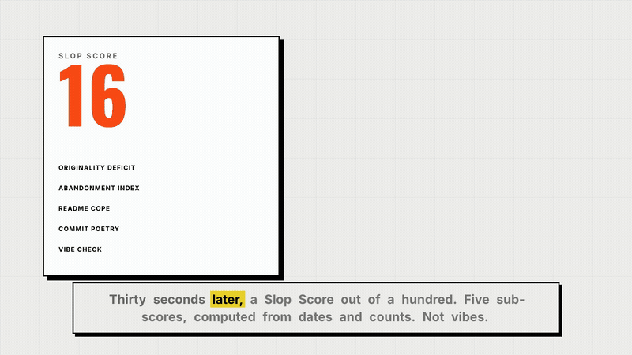

<p align="center">
  
</p>

<h1 align="center">Product Hunt for slop.</h1>

<p align="center">
  <strong>Submit your repo. Get roasted. Get ranked.</strong><br />
  An evidence-backed AI code review with the emotional support removed.
</p>

<p align="center">
  <a href="#watch">Watch</a> ·
  <a href="#run-it-locally">Run locally</a> ·
  <a href="./docs/project-details.md">Read the build spec</a>
</p>

## Watch

<p align="center">
  
</p>

<p align="center">
  <a href="https://github.com/igharsha7/SlopHunt/releases/download/v1.0/launch-video.mp4"><strong>▶ Launch film — 55s, with sound</strong></a>
  &nbsp;·&nbsp;
  <a href="https://github.com/igharsha7/SlopHunt/releases/download/v1.0/Video.mp4"><strong>▶ Full walkthrough — 2m 10s</strong></a>
</p>

<p align="center">
  <sub>The loop above is silent and muted by design. The films have narration.</sub>
</p>

## What is SlopHunt?

SlopHunt is Product Hunt's evil twin. Developers submit their own GitHub repos
to receive a brutally specific, evidence-backed roast, a **Slop Score™**, and a
public product page their project never asked for.

The point is not to dunk on people. It is to give abandoned side projects the
honest feedback—and occasionally the attention—they were never going to get
from “Congrats on the launch! 🚀”.

## The loop

| Step | What happens |
| --- | --- |
| **01 — Submit** | Paste a GitHub repository you own or that carries the `roast-me` topic. |
| **02 — Investigate** | Agents crawl the README, commits, file tree, languages, issues, site, and similar products. |
| **03 — Roast** | The roast engine turns specific evidence into a dry, devastating verdict. |
| **04 — Rank** | The repo gets a Product-Hunt-style page, a Slop Score, receipts, and a place on the leaderboard. |

The text roast and score are instant. Video rendering is intentionally
asynchronous—the disappointment takes time.

## What gets judged

- **Originality Deficit** — how many existing products already do this.
- **Abandonment Index** — commit recency and frequency decay.
- **README Cope Level** — promises, badges, “coming soon,” and dead demos.
- **Commit Poetry** — `fix`, `wip`, `asdf`, and the timeless `final final v2`.
- **Vibe Check** — TODO density, dead code, suspicious files, and other crimes
  against a peaceful codebase.

Every roast must cite real crawl data. No evidence, no joke.

## Built with

- **Next.js 16**, TypeScript, Tailwind CSS v4, and GSAP
- **Supabase** for Postgres, RLS, GitHub OAuth, and storage
- **GitHub REST API** for repository intelligence
- **Grok** for roast writing, with Claude and deterministic fallbacks
- **HyperFrames + Kokoro** for the asynchronous local roast-video pipeline
- **next/og** for share cards

## Run it locally

```bash
npm install
cp .env.example .env.local
npm run dev
```

Open [http://localhost:3000](http://localhost:3000). The interface works with
demo fixtures while you configure Supabase and external services.

For the full stack:

1. Apply `supabase/migrations/0001_init.sql` in the Supabase SQL Editor.
2. Enable GitHub under Supabase Authentication → Providers.
3. Fill in the server-only secrets in `.env.local`; never commit this file.
4. Start the local render backend with `npm run server` when testing video.

### Useful commands

```bash
npm run lint
npm test
npm run db:verify
npm run video:render  # requires the local HyperFrames renderer and ffmpeg
```

## House rules

- **Self-submission only.** Roast your own repository, or one explicitly tagged
  `roast-me`.
- **Roast the software, never the person.**
- **Keep receipts.** Every joke is grounded in crawl data.
- **Protect secrets.** Possible leaks are flagged, never displayed.
- **Never block the instant path on video.**

## Documentation

- [Build spec](./docs/project-details.md)
- [HyperFrames + LangGraph implementation guide](./docs/hyperframes-implentation.md)
- [Environment variable reference](./.env.example)

---

Built for developers with unfinished repos and the courage to hear about them.
