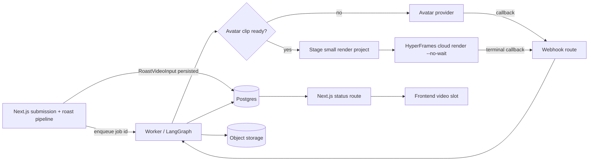
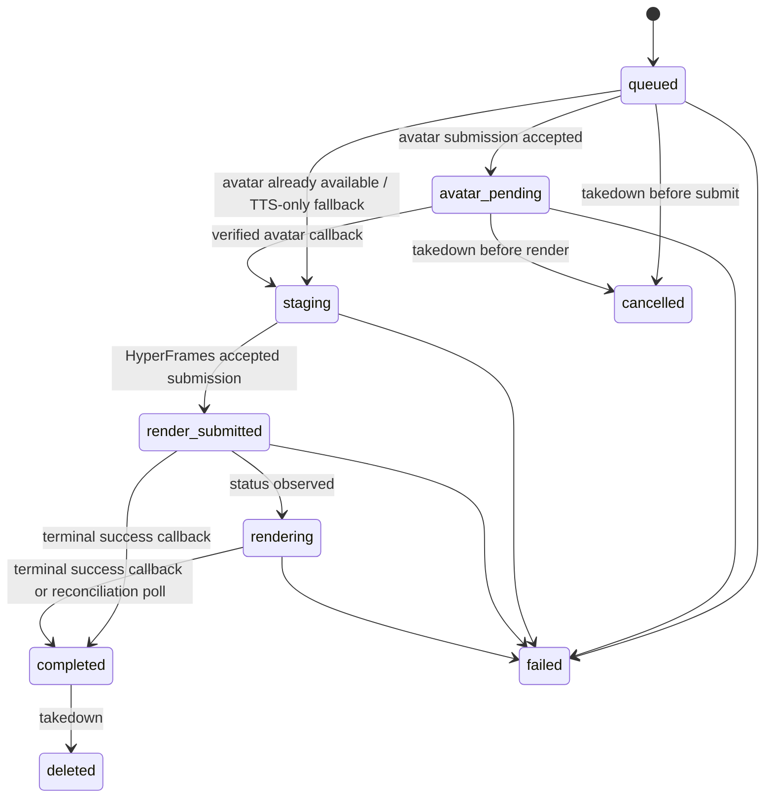
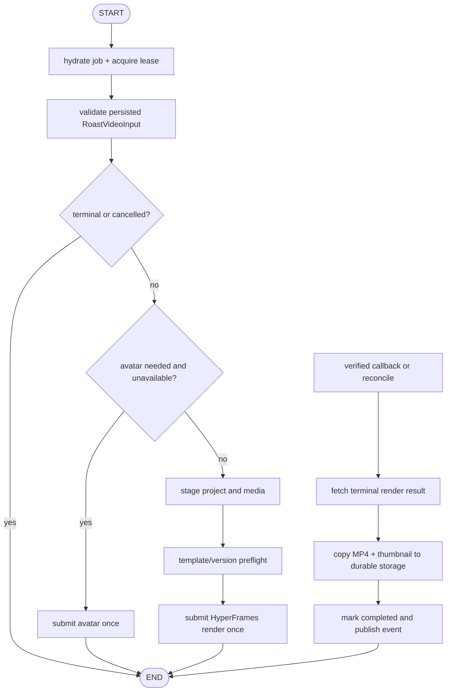

# SlopHunt: HyperFrames implementation guide

> Purpose: an implementation-ready plan for the asynchronous “Deepak from Code
> Review” roast video. This document deliberately covers the backend/worker
> boundary only; the Next.js frontend can consume the API and status contract
> without owning video rendering.

## Decision summary

Use a **versioned, hand-authored HyperFrames HTML template** with typed render
variables. Do not ask an LLM to generate arbitrary HTML/CSS per repository.
The LLM's job ends at producing the evidence-backed `video_script` and a small,
validated `RoastVideoInput` object. The renderer then turns those known fields
into a predictable 9:16 video.

For the first shippable version:

- Render one fixed, vertical `1080 × 1920`, 30fps, 35–42 second composition.
- Use LangGraph JS in a separate worker process; keep Next route handlers thin.
- Use HyperFrames managed cloud rendering for the production path. It supports
  fire-and-forget submission, callbacks, and polling, so a video never blocks a
  product-page response.
- Use a real host/avatar clip when available. HyperFrames composes HTML and
  media into video; it is **not** itself an avatar-generation API. Generate the
  talking-head asset through HeyGen (or another approved avatar provider), then
  use HyperFrames to add evidence cards, site screenshots, captions, score
  reveal, transitions, and final MP4 encoding.
- Ship a deterministic mock provider first. It lets the frontend work before
  HeyGen/HyperFrames credentials and credits are available.

HyperFrames is a good fit because its source is plain HTML/CSS plus seekable
animations and is rendered deterministically by Chromium/FFmpeg. The official
CLI requires Node 22+ and FFmpeg for local authoring; managed cloud rendering
does not require those dependencies on the application host. [HyperFrames
README](https://github.com/heygen-com/hyperframes)

## What this solves

The normal SlopHunt path remains fast:

1. Repo crawl, scoring, receipts, and text roast complete.
2. The product page and leaderboard update immediately with
   `video_status: "queued"`.
3. A background graph prepares, submits, and tracks the video.
4. The frontend polls a lightweight status route (or later receives SSE) until
   the durable video URL is present.

The graph must never be invoked inside a request that serves the product page.
Doing so would make the “instant path” depend on avatar and render latency.



## Explicit boundaries

| Concern | Owner | Rule |
| --- | --- | --- |
| Repo ownership, crawl, score, receipts, and roast quality | existing SlopHunt pipeline | Produce evidence-backed structured data before video work begins. |
| Video input validation and orchestration | LangGraph worker | Only accepts a persisted job ID; no browser/session state. |
| Talking host footage | avatar/TTS provider adapter | Provider-specific, async, and replaceable. Never couple this to a page route. |
| Composition, captions, evidence cards, and score reveal | HyperFrames template | Versioned HTML. No arbitrary runtime-generated composition code. |
| Final MP4, thumbnail, and lifecycle | object storage + video job record | Persist durable object keys, never a temporary signed provider URL. |
| Product-page rendering and status UX | frontend agent | Consumes contracts below; it does not know provider credentials or render internals. |

## Data contract for the frontend and roast pipeline

Create this object directly from the existing roast/analysis result. Validate it
with Zod both when it is written and when the worker reads it. Keep the field
limits intentional: text overflow is a rendering defect, not something to
silently “handle” after the render starts.

```ts
import { z } from "zod";

const EvidenceSchema = z.object({
  label: z.string().trim().min(3).max(44),
  detail: z.string().trim().min(3).max(150),
  sourceUrl: z.string().url().max(2_048),
});

export const RoastVideoInputSchema = z.object({
  repoId: z.string().uuid(),
  roastId: z.string().uuid(),
  owner: z.string().trim().min(1).max(39),
  repo: z.string().trim().min(1).max(100),
  slopScore: z.number().int().min(0).max(100),
  videoScript: z.string().trim().min(80).max(1_150),
  oneLiner: z.string().trim().min(8).max(96),
  crimes: z.array(EvidenceSchema).min(2).max(3),
  screenshotUrl: z.string().url().max(2_048).nullable(),
  templateVersion: z.literal("deepak-v1"),
});

export type RoastVideoInput = z.infer<typeof RoastVideoInputSchema>;
```

Important rules:

- `crimes[*].detail` must already be safe for public display and trace to an
  allowed evidence item. Never pass secret values, `.env` contents, access
  tokens, raw stack traces, or unreviewed README HTML to the video system.
- Treat every field as text, not HTML. Render it with `textContent`/
  `data-var-text`, never `innerHTML`.
- The screenshot is optional. A branded “no demo survived long enough” frame is
  preferable to a failed external image request.
- Store the exact validated JSON in `video_jobs.input_json`. This makes each
  render reproducible and lets you retry without re-running an LLM.

### Product-page API contract

These routes are deliberately simple for the incoming frontend. Names can be
adapted to the final App Router layout, but keep the response shape stable.

```http
POST /api/repos/:repoId/video
```

Server-only endpoint. It creates or returns the active job for the latest
completed roast. It is idempotent for `(repo_id, roast_id, template_version)`.

```json
{
  "jobId": "b1b85434-0c31-4cf5-a2d6-e30ee3b3a61b",
  "status": "queued",
  "statusMessage": "Your roast is rendering… the disappointment takes time."
}
```

```http
GET /api/video-jobs/:jobId
```

```json
{
  "id": "b1b85434-0c31-4cf5-a2d6-e30ee3b3a61b",
  "status": "rendering",
  "statusMessage": "Deepak is finding the least kind way to read this aloud.",
  "videoUrl": null,
  "thumbnailUrl": null,
  "updatedAt": "2026-07-18T10:31:42.000Z"
}
```

Only return `videoUrl` and `thumbnailUrl` after the worker has copied them to
our storage/CDN. Do not expose an upstream render ID, credential, callback
token, filesystem location, or short-lived provider URL.

## Storage model and status state machine

Add a `video_jobs` table rather than overloading a roast row. It represents an
attempted external workflow, provides an audit trail, and enables a user to
delete the asset later.

```sql
create type video_job_status as enum (
  'queued',
  'avatar_pending',
  'staging',
  'render_submitted',
  'rendering',
  'completed',
  'failed',
  'cancelled',
  'deleted'
);

create table video_jobs (
  id uuid primary key,
  repo_id uuid not null references repos(id) on delete cascade,
  roast_id uuid not null references roasts(id) on delete cascade,
  template_version text not null,
  input_json jsonb not null,
  input_hash text not null,
  status video_job_status not null default 'queued',
  graph_thread_id text not null unique,
  avatar_provider text,
  avatar_job_id text unique,
  render_provider text,
  render_job_id text unique,
  callback_token_hash text not null,
  artifact_prefix text,
  video_object_key text,
  thumbnail_object_key text,
  error_code text,
  error_message text,
  attempts integer not null default 0,
  created_at timestamptz not null default now(),
  updated_at timestamptz not null default now(),
  completed_at timestamptz
);

create unique index video_jobs_one_active_input
  on video_jobs (repo_id, roast_id, template_version, input_hash)
  where status not in ('deleted');
```

Also add `video_job_events` for received provider callbacks. Give it a unique
`(provider, external_event_id)` key (or a canonical payload hash if the
provider has no event ID). Persist the raw payload only after redacting any
credentials. This makes webhook delivery idempotent and debuggable.

State transitions:



`completed`, `failed`, `cancelled`, and `deleted` are terminal. A retry creates
a new job record with a new idempotency key; do not mutate a terminal job back
to `queued`.

## The LangGraph design

Use LangGraph because the video path pauses at external boundaries and needs a
durable resume point, not because every step needs an agent. Most nodes should
be deterministic TypeScript functions. LangGraph checkpoints state at graph
step boundaries; use `PostgresSaver` in production and map one video job to one
`thread_id` such as `video-job:<job-id>`. [LangGraph persistence
docs](https://docs.langchain.com/oss/javascript/langgraph/persistence)

Use LangChain only where model work is genuinely required (for example, a
future script compression/rewrite). Request Zod-validated structured output,
never parse an LLM's prose into a render request. [LangChain structured-output
docs](https://docs.langchain.com/oss/javascript/langchain/structured-output)

### State

Keep LangGraph state JSON-serializable and small. The database/object store is
the source of truth for large scripts, binary assets, and full provider payloads.

```ts
type VideoGraphEvent =
  | { type: "start" }
  | { type: "avatar_callback"; providerEventId: string }
  | { type: "render_callback"; providerEventId: string }
  | { type: "reconcile" };

type VideoGraphState = {
  jobId: string;
  event: VideoGraphEvent;
  jobStatus?: string;
  avatarReady?: boolean;
  renderReady?: boolean;
  failure?: { code: string; message: string };
};
```

### Nodes and edges



Implement the graph's entry router so `render_callback` and `reconcile` events
go directly to the finalization path. Do not hold a Node process open while a
provider renders. The callback route writes a deduplicated event, then invokes
the graph again with the same `thread_id`.

Suggested node responsibilities:

| Node | Work | Safe retry behaviour |
| --- | --- | --- |
| `hydrateJob` | Lock/load job, reject deleted jobs, read persisted input. | Read-only or lease renewal. |
| `validateInput` | Zod parse, policy check, URL allow-list, content limits. | Deterministic. |
| `submitAvatar` | Submit a host clip only if `avatar_job_id` is absent. | Provider idempotency key = job id + `:avatar`. |
| `stageProject` | Copy template and approved assets into a per-job temp directory. | Existing artifact prefix is reused. |
| `preflightTemplate` | Check template version has passed CI; verify required staged files exist. | Deterministic. |
| `submitRender` | Start exactly one HyperFrames cloud render. | Idempotency key = job id + `:render`. |
| `finalizeRender` | Re-fetch provider status, copy completed artifacts, update row. | Re-copy only if durable object is absent. |
| `failJob` | Write a safe public status and an internal diagnostic. | Terminal, idempotent. |

Use a database lease or queue-level uniqueness lock before each graph invocation.
Webhooks and scheduled reconciliation can otherwise invoke the same graph at
the same time.

### Graph skeleton (illustrative TypeScript)

```ts
// worker/video-graph.ts — deliberately deterministic; provider calls live in adapters.
const configFor = (jobId: string) => ({
  configurable: { thread_id: `video-job:${jobId}` },
});

export async function startVideo(jobId: string) {
  return videoGraph.invoke({ jobId, event: { type: "start" } }, configFor(jobId));
}

export async function resumeVideo(
  jobId: string,
  event: Extract<VideoGraphEvent, { type: "avatar_callback" | "render_callback" }>,
) {
  return videoGraph.invoke({ jobId, event }, configFor(jobId));
}
```

Use a persistent checkpointer, but make all non-idempotent operations durable
*before* calling a provider. Specifically: save a generated callback token,
provider idempotency key, and "submission requested" state in the transaction;
then submit; then save the returned external ID. If the worker dies between the
last two actions, reconcile by provider idempotency key instead of blindly
submitting again.

LangGraph's `interrupt()` mechanism is useful only if SlopHunt later offers a
human “approve this roast video before publishing” review. It requires a
persistent checkpointer and restarts the interrupted node on resume, so all work
before an interrupt must also be idempotent. [LangGraph interrupt
docs](https://docs.langchain.com/oss/javascript/langgraph/interrupts)

## HyperFrames template contract

Store the template with the worker, separate from the Next app:

```text
apps/video-worker/
  src/
    graph/
    providers/
      avatar.ts
      hyperframes.ts
      storage.ts
    templates.ts
  templates/
    deepak-v1/
      index.html
      assets/
        deepak-fallback.png
        bgm.mp3
        fonts/
      .hyperframesignore
      README.md
```

Each job gets an ephemeral directory such as
`/tmp/slophunt-video/<job-id>/deepak-v1/`. It contains a copy of the template
and only the assets required by that exact render. Delete the temp directory
after the MP4 and thumbnail have been copied to durable storage.

### Fixed scene plan

Do not make duration a variable. HyperFrames reads a root `data-duration`
before scripts run, so a runtime value cannot alter total render length. Use a
single comfortably paced length and truncate/condense the input beforehand.

| Time | Scene | Render data |
| --- | --- | --- |
| 0–3s | Cold hook | repo name + worst one-liner |
| 3–24s | Deepak reads the setup | avatar clip + first two evidence cards |
| 24–33s | “Already exists” / site evidence | screenshot + final receipt/crime |
| 33–40s | Score reveal | big Slop Score + category bars |
| 40–42s | End card | `slophunt` branding + product URL |

If a host clip is only 30–35 seconds, use its spoken material for the first
three scenes and let the last scenes become motion graphics plus BGM. This is
preferable to stretching a face video past its source duration.

### Required composition properties

HyperFrames uses DOM `data-*` timing attributes. The root needs a unique
composition ID, fixed pixel dimensions, a fixed duration, and one synchronously
created paused timeline registered under the same ID. Visible timed elements
need `class="clip"`, `data-start`, `data-duration`, and `data-track-index`.

```html
<html
  data-composition-variables='[
    {"id":"repoName","type":"string","label":"Repository","default":"owner/repo"},
    {"id":"score","type":"number","label":"Slop Score","default":50,"min":0,"max":100},
    {"id":"oneLiner","type":"string","label":"One-liner","default":"It compiled once."},
    {"id":"screenshot","type":"string","label":"Site screenshot","default":"assets/fallback-site.png"}
  ]'
>
  <body>
    <main id="root" data-composition-id="deepak-roast-v1"
      data-width="1080" data-height="1920" data-duration="42" data-fps="30">

      <!-- Host media must remain a direct root child. -->
      <video id="host-video" class="clip" src="assets/host.mp4"
        data-start="0" data-duration="33" data-track-index="0" muted playsinline></video>
      <audio id="host-audio" src="assets/host.mp4"
        data-start="0" data-duration="33" data-track-index="10" data-volume="1"></audio>

      
      <section id="score-card" class="clip" data-start="33" data-duration="7"
        data-track-index="2">…</section>
    </main>
    <script>
      const tl = gsap.timeline({ paused: true });
      // Add only seekable, finite animations here.
      window.__timelines["deepak-roast-v1"] = tl;
    </script>
  </body>
</html>
```

The example omits styles and the full timeline for clarity. The finished
template must also follow these non-negotiable rules:

- `<video>` and `<audio>` are direct children of the root. HyperFrames owns
  their seeking and playback. The video stays muted; a separate root-level
  `<audio>` element carries its sound.
- Create the paused GSAP timeline synchronously. Never use a render-time clock,
  unseeded random value, network fetch, user input state, or infinite animation
  to determine pixels.
- Let the framework control `.clip` visibility. Do not animate `display` or raw
  `visibility` on a clip.
- Use fixed-size text containers, max lengths, wrapping, and `fitTextFontSize`
  where necessary. Do not use arbitrary `<br>` tags in variable text.
- Keep full-screen backgrounds on a full-bleed child clip, not on the root.
- Give every assembled DOM element a globally unique ID.

These constraints are why the initial template uses three evidence slots, a
fixed duration, and fixed field limits rather than unlimited dynamic content.

### Avatar and TTS variants

Implement both behind a `HostMediaProvider` interface:

```ts
interface HostMediaProvider {
  submit(input: RoastVideoInput, idempotencyKey: string): Promise<{
    externalJobId: string;
    status: "queued" | "ready";
    mediaUrl?: string;
  }>;
  get(externalJobId: string): Promise<{
    status: "queued" | "ready" | "failed";
    mediaUrl?: string;
  }>;
}
```

1. **Primary:** an avatar provider returns a vertical Deepak talking-head MP4.
   The worker downloads/transcodes it to a safe, predictable local asset before
   packaging the HyperFrames project.
2. **Fallback:** generate TTS audio, use `deepak-fallback.png` or a subtle
   illustrated host, and let HyperFrames animate the supporting evidence. The
   product still gets a video if avatar rendering is unavailable.
3. **Mock:** return a checked-in, innocuous 5–10 second sample MP4 plus a
   matching audio track after a configurable delay. Never call paid providers
   in local tests.

## Render adapter and provider callbacks

Encapsulate the CLI/API behind `HyperframesRenderProvider`. The rest of the
graph should only see `submit`, `get`, and `cancel`.

```ts
interface HyperframesRenderProvider {
  submit(args: {
    projectDir: string;
    callbackUrl: string;
    callbackId: string;
    idempotencyKey: string;
  }): Promise<{ renderId: string }>;
  get(renderId: string): Promise<{
    status: "queued" | "rendering" | "completed" | "failed";
    videoUrl?: string;
    thumbnailUrl?: string;
    error?: { code?: string; message: string };
  }>;
}
```

The managed-cloud implementation can invoke the documented CLI pattern:

```bash
npx hyperframes cloud render . \
  --quality high \
  --callback-url "$CALLBACK_URL" \
  --callback-id "$VIDEO_JOB_ID" \
  --idempotency-key "$VIDEO_JOB_ID:render" \
  --no-wait
```

HyperFrames cloud rendering zips the project, uploads it, submits a render, and
can return immediately with `--no-wait`. Its terminal callback/polling path is
designed for this asynchronous workflow. Inspect a job's archive first with
`cloud render --dry-run --json`; the upload limit is 200 MB. [HyperFrames cloud
rendering guide](https://github.com/heygen-com/hyperframes)

Implementation notes:

- Pin the HyperFrames CLI in the worker's `package.json`. It changes quickly;
  record the version in `template_version` or a separate `renderer_version`
  column. Check for newer releases before upgrading, then rerun template
  snapshots/checks. The latest release observed while writing this guide was
  `v0.7.62` on 2026-07-18. [Release
  notes](https://github.com/heygen-com/hyperframes/releases)
- Run the CLI with an argument array via `execa`/`spawn`, never a concatenated
  shell string. Keep the job workspace as its current directory.
- Generate the callback URL with an unguessable per-job token, for example
  `/api/internal/video-callbacks/hyperframes/<job-id>/<token>`. Store only a
  hash of that token. Do not assume a provider signature unless the selected
  provider documents and implements one.
- A cloud `video_url`/`thumbnail_url` is a short-lived signed URL. On terminal
  success, fetch it immediately, virus-scan if that is part of the storage
  policy, write it to our object storage, and persist the resulting object key.
- Use a scheduled reconciliation task for every active job. Polling is the
  recovery mechanism for a callback lost to a deployment or transient network
  failure, not the normal foreground path.
- Never automatically retry a render submission without the same idempotency
  key. Uploading/rendering can otherwise duplicate a billed render.

### Per-job package vs reusable cloud template

Start with a per-job project directory. It is the most reliable way to include
the avatar clip, screenshot, font, and fallback assets with the exact render.
Add a narrow `.hyperframesignore` for generated outputs only; never exclude the
composition, mounted files, fonts, media, or all `assets/` merely to reduce the
archive.

Later, optimize with a reusable uploaded template (`asset_id`) plus render
variables. HyperFrames supports this "upload once, render many" model. Adopt it
only after an end-to-end test proves that the chosen render environment can
retrieve every variable-bound remote image/video with the required CORS policy.
It is an optimization, not an MVP dependency.

## Security and safety rails

The video worker inherits SlopHunt's safety rules and adds these:

- Start jobs only after the consent/ownership check has passed.
- Roast software and evidence, never the owner. The worker rejects input that
  lacks cited crimes or fails the final roast-safety policy.
- Do not make the worker crawl arbitrary URLs. Its only URL inputs come from
  already-approved artifacts. Enforce `https`, DNS/IP private-network blocking,
  redirect limits, content-type/size limits, and a host allow-list where
  possible when staging media.
- Never include detected secrets in `input_json`, logs, captions, screenshots,
  or template variables. Store a generic crime such as “possible leaked secret
  detected; rotate it” instead.
- Treat callback paths as authentication secrets; rate-limit them and reject
  unexpected content types, payload sizes, provider IDs, or terminal-state
  regressions.
- A takedown must cancel future work where provider APIs allow it, mark the job
  deleted, remove durable MP4/thumbnail objects, and make the status endpoint
  return `404`. A late callback must not restore a deleted asset.
- Log IDs, statuses, render durations, and safe error codes—not scripts,
  private repo data, provider auth headers, or callback tokens.

## Environment and deployment

```dotenv
# Shared backend
DATABASE_URL=
OBJECT_STORAGE_BUCKET=
OBJECT_STORAGE_REGION=
OBJECT_STORAGE_ACCESS_KEY=
OBJECT_STORAGE_SECRET_KEY=
NEXT_PUBLIC_APP_URL=
VIDEO_CALLBACK_SECRET=

# HyperFrames managed cloud
HEYGEN_API_KEY=
HYPERFRAMES_RENDER_MODE=mock # mock | cloud | local

# Host media, if separate from the HyperFrames cloud credential
HOST_MEDIA_MODE=mock # mock | avatar | tts
HOST_MEDIA_API_KEY=

# Local authoring/CI only
# Node >=22 and ffmpeg available on PATH
```

Recommended packages (validate versions at install time):

```text
@langchain/langgraph
@langchain/langgraph-checkpoint-postgres
langchain
zod
execa
postgres or the project's chosen Postgres client
```

Run the graph in a worker/container, not a Vercel-style request runtime. The
worker needs enough disk for one short avatar MP4, the staged project, the
downloaded final MP4, and cleanup. Limit concurrency initially to one or two
renders per account to control credits and avoid burst failures.

## Verification plan

### Template CI (on every template/version change)

1. Pin the CLI and scaffold/update the template with the current HyperFrames
   workflow skills.
2. Run `npx hyperframes lint` while authoring.
3. Run `npx hyperframes check` as the final automated gate.
4. Capture representative mid-scene snapshots and inspect the contact sheet:
   long repo name, score 0/100, no screenshot, all three evidence cards, and
   the fallback host path.
5. Render one short local draft or cloud smoke test, confirm a non-empty MP4,
   and verify its duration with `ffprobe`.
6. Run `npx hyperframes cloud render . --dry-run --json` before production
   cloud tests to inspect the exact archive size and contents.

The HyperFrames authoring loop is lint → `check` → final preview → approved
render. `check` includes runtime, layout, motion, and contrast checks; it should
not be replaced by a standalone lint command. [HyperFrames CLI
documentation](https://github.com/heygen-com/hyperframes)

### Worker tests

- Unit-test `RoastVideoInputSchema`, max lengths, score bounds, public-text
  sanitization, callback-token verification, and every legal state transition.
- Test duplicate start requests, duplicate callbacks, callback-after-delete,
  avatar failure, render failure, and a worker crash after submission.
- Contract-test `GET /api/video-jobs/:id` against the frontend's loading,
  success, and failure states.
- In mock mode, assert that the text page path returns before the video worker
  finishes.
- Add one opt-in integration test using sandbox credentials; do not run paid
  cloud/host generation on every pull request.

## Build sequence once the frontend lands

1. Agree on the two API payloads above and add a static frontend video slot.
2. Add `video_jobs`, object-storage helpers, and the mock render provider.
3. Build the `deepak-v1` template and make its local CI pass with hostile test
   data.
4. Add the LangGraph worker/checkpointer/queue entry point and status polling.
5. Add a real avatar or TTS provider behind `HostMediaProvider`.
6. Add managed HyperFrames submission, authenticated callback handling, durable
   artifact copy, and reconciliation.
7. Run the full consented dogfood flow on a known repo; only then enable
   production video creation.

At every phase, the frontend should be able to render a useful state from the
same API: `queued`, `rendering`, `completed`, or `failed`. Video is an
enhancement; it must never prevent a completed roast page from existing.

## Sources and version watch

- [HyperFrames repository and rendering architecture](https://github.com/heygen-com/hyperframes)
- [HyperFrames releases](https://github.com/heygen-com/hyperframes/releases)
- [LangGraph persistence](https://docs.langchain.com/oss/javascript/langgraph/persistence)
- [LangGraph interrupts](https://docs.langchain.com/oss/javascript/langgraph/interrupts)
- [LangChain structured output](https://docs.langchain.com/oss/javascript/langchain/structured-output)

Before implementation, re-check the HyperFrames release notes and CLI help:

```bash
npx hyperframes@latest upgrade --project . --check
npx hyperframes cloud render --help
```

The template's pinned CLI should only be upgraded after `npx hyperframes check`
and snapshot/render verification pass on the new version.
